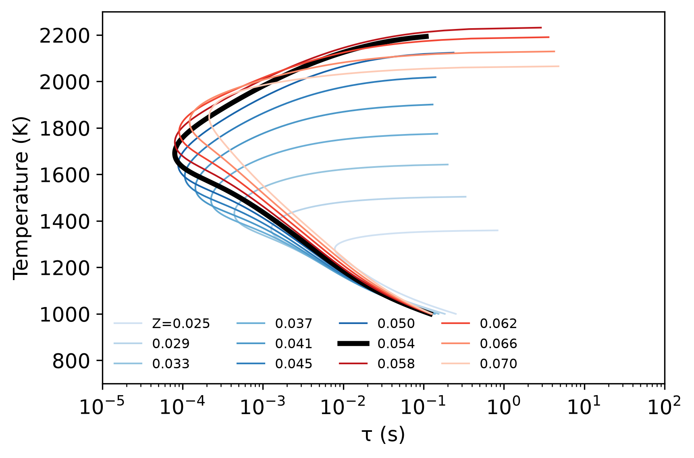

\mainpage

<!-- #################################################################### -->

# Overview

[Bones](https://github.com/BYUignite/bones.git) is a C++ code for computing skeletal mechanisms using the Directed Relation Graph (DRG) method. The code reduces a detailed mechanism to a skeletal mechanism by removing species and reactions that are deemed unimportant for the target species. The code is designed to be flexible and extensible, allowing users to easily modify the reduction criteria and add new features. The reduction is done using the full S-curve of a perfectly stirred reactor (PSR) simulation, solved with several stoichiometric ratios. The skeletal mechanism in Cantera format is output to a file.

# Dependencies and installation

The code is intended to be built and used on Linux-like systems, including MacOS and the Linux subsystem for Windows.

Required software:
- CMake 3.15+
- C++17
- [SUNDIALS](https://computing.llnl.gov/projects/sundials)
    - CVODE and KINSOL
- [Cantera](https://cantera.org/) for reading and writing Cantera input files, and performing PSR simulations

Optional software:
- [Doxygen](https://www.doxygen.nl/) (for building documentation)
- [graphviz](https://graphviz.org/download/) (for Doxygen)

## Build and installation instructions
1. Create and navigate into a top-level `build` directory
2. Configure CMake: `cmake ..`
3. Build: `make`
4. Install: `make install`

The build process installs the executable in `run/bones.x`.

## CMake configuration variables
The default CMake configuration should be adequate for users that do not immediately require the documentation. CMake configuration options can be set by editing the top-level `CMakeLists.txt` file, or specifying options on the command line during step 2 as follows:
```
cmake -DBUILD_DOCS=ON ..
```
Then build the documentation with `make docs`, and navigate to `docs/index.html` to view the documentation.

# Using Bones

Bones is called from the command line in the `run` directory. The code can be run with the following options:
- `./bones.x`
- `./bones.x pathTo/someInputFile.yaml`
In the first case, the code uses file `../input/input.yaml`.

# Methodology

The DRG method is implemented as described in \cite Lu_2005, \cite Lu_2006. A detailed mechanism with \f$n_r\f$ reactions and \f$n_s\f$ species is described in terms of the rate of progress variable \f$q_i\f$ for each reaction, and the net stoichiometric coefficients \f$\nu_{i,k}\f$ for species \f$i\f$ in reaction \f$k\f$. The importance of species \f$B\f$ to species \f$A\f$ is quantified by

\f[
\sigma_{A,B} = \frac{\sum_{k=1}^{N_R}|\nu_{A,k} q_k\delta_{B,k}|}{\sum_{k=1}^{N_R}|\nu_{B,k} q_k|},
\f]

which is a nondimensional measure of the importance of species \f$B\f$ to species \f$A\f$. Here, \f$\delta_{B,k}\f$ is 1 if species \f$B\f$ is in reaction k and 0 otherwise. \f$\sigma_{AB}\f$ can be thought of as the total "strenth" of reactions containing both \f$A\f$ and \f$B\f$, as measured by the total magnitude of the net reaction rate of rate of \f$A\f$ from reactions containing \f$B\f$, scaled by the same quantity for all reactions with \f$A\f$. The absolute values avoid cancellation of signs. Other measures for \f$\sigma_{A,B}\f$ have been proposed in the literature.

The \f$\sigma_{A,B}\f$ values can be computed for all species pairs, but in practice, \f$\sigma_{A,B}\f$ is computed for all \f$A\f$, but only for \f$B\f$ with reactions containing \f$A\f$. The \f$\sigma_{A,B}\f$ are used to remove unimportant species and associated reactions from a detailed mechanism based on a desired tolerance \f$\epsilon\f$, resulting in a skeletal mechanism. This is done as follows for a given chemical state \f$\Pi\f$.
- A vector of sets \f$\beta_A\f$ is computed in which vector element \f$i\f$ contains the set of species that share reactions with species \f$i\f$. \f$\beta_A\f$ is fixed for a given detailed mechanism, and is computed in the DRG constructor.
- \f$\beta_A\f$ is then reduced to \f$\tilde{\beta}_A\f$: for each species \f$i\f$, the set \f$(\tilde{\beta}_A)_i\f$ contains only species \f$j\f$ with \f$\sigma_{i,j} \le\epsilon\f$. Hence, \f$(\tilde{\beta}_A)_i \subseteq (\beta_A)_i\f$.
- The collection of sets defined by \f$\tilde{\beta}_A\f$ is combined into a single set \f$S_\Pi\f$ of final species in the skeletal mechanism.
    - The user specifies one or more principle species \f$p\f$ that should remain in \f$S_\Pi\f$. This could just be the primary fuel, but may also contain desired intermediates.
    - For each of these primary species \f$p\f$, \f$S_\Pi\f$ is recursively filled, first with \f$p\f$, then with species in set \f$(\tilde{\beta}_A)_p\f$. As per the definition of a set, there are no duplicates. The filling is done recursively because the species \f$j\in (\tilde{\beta}_A)_p\f$ have their own species they depend on in set \f$(\tilde{\beta}_A)_j\f$, and so forth.

All of this was done for a given chemical state \f$\Pi\f$. But many such states are realized in practice, and it is good to have a mechanism built using an exhaustive set of chemical states. This can be done in many ways, including, e.g., premixed or nonpremixed flames of varying strain, autoignition, etc. Here, we apply the method to the full chemical states of a perfectly stirred reactor (PSR) consisting of the burning (approaching adiabatic equilibrium) and unstable intermediate branches of the S-curve, and for a range of stoichiometries from lean to rich. The final skeletal species are then constructed so that \f$S\supseteq S_\Pi\f$ for all \f$S_\Pi\f$. The skeletal mechanism consists of the species in \f$S\f$ and all reactions involving only those species. Additional species can be added to the mechanism that may not have any associated reactions, such as \f$\ce{N2}\f$. The final mechanism is written to a Yaml file in Cantera format with a user-specified file name.

The steady adiabatic PSR equations are given by

\f[
\frac{y_i^{in}-y_i}{\tau} = -\frac{\dot{m}^{\prime\prime\prime}}{\rho},
\f]
\f[
h(y_i) = h(y_i^{in}).
\f]

Normally, one sets \f$\tau\f$ and solves for mass fractions \f$y_i\f$, and temperature \f$T\f$. To get the full S-curve, it is convenient to set \f$T\f$ and treat \f$\tau\f$ as an unknown. We start with \f$T\f$ just below \f$T_{ad}\f$, and solve with decreasing T until some desired minimum temperature \f$T_{min}\f$. The S-curve for multiple stoichiometries is computed.


# Example

An example of the DRG method uses the GRI 3.0 mechanism burning 12 methane-air mixtures with mixture fraction varying from 0.25 to 0.7. Two-hundred and one temperatures from \f$T_{ad}-1\, K\f$ to \f$T_{min}=1000\, K\f$ were computed for each mixture fraction. \f$\ce{CH4}\f$ is treated as a primary species and \f$\ce{N2}\f$ as an extra species. The tolerance is set at \f$\epsilon = 0.3\f$. This results in a mechanism with the following 15 species: \f$\ce{H2}\f$, \f$\ce{H}\f$, \f$\ce{O}\f$, \f$\ce{O2}\f$, \f$\ce{OH}\f$, \f$\ce{H2O}\f$, \f$\ce{HO2}\f$, \f$\ce{CH3}\f$, \f$\ce{CH4}\f$, \f$\ce{CO}\f$, \f$\ce{CO2}\f$, \f$\ce{HCO}\f$, \f$\ce{CH2O}\f$, \f$\ce{CH3O}\f$, \f$\ce{N2}\f$.


{html: width=800}
